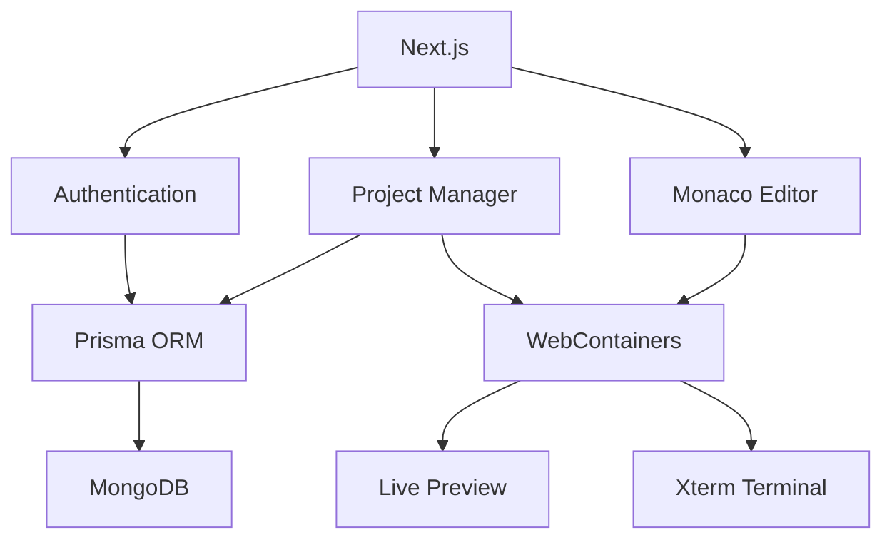

<div align="center">

# 🚀 VibeCode Editor

### A Full-Stack AI-Powered Online Code Editor Built with Next.js, Monaco Editor & WebContainers

Write, edit, run, and preview code directly in your browser with an IDE-like experience powered by modern web technologies.

<!-- Replace these with your actual links -->


<p align="center">


</p>

<p align="center">


</p>

</div>

---

## 📖 Overview

VibeCode Editor is a cloud-based online development environment that allows users to create, manage, edit, and preview projects entirely in the browser.

Inspired by modern IDEs like VS Code, the platform provides an intuitive development experience with secure authentication, project management, Monaco Editor integration, browser-based code execution using WebContainers, an integrated terminal, and live preview capabilities.

Whether you're learning web development or building applications, VibeCode Editor provides a seamless coding workflow without requiring any local setup.

---

# ✨ Features

### 🔐 Authentication

- Google OAuth Login
- GitHub OAuth Login
- Secure session management using Auth.js

### 📁 Project Management

- Create projects
- Delete projects
- Dashboard for managing projects
- Responsive project cards

### 💻 Code Editor

- Monaco Editor (VS Code Experience)
- Multi-file editing
- Syntax highlighting
- Auto-save support
- File Explorer

### ⚡ Browser-based Development

- WebContainers Integration
- Live project execution
- Browser terminal
- Real-time preview

### 🖥️ Terminal

- Integrated Xterm.js terminal
- Command execution
- Interactive development environment

### 🎨 Modern UI

- Responsive Design
- Dark Theme
- Clean Developer Experience
- Smooth Animations

---

# 🛠 Tech Stack

## Frontend

- Next.js 16
- React 19
- TypeScript
- Tailwind CSS v4
- Base UI
- Radix UI
- Zustand

## Backend

- Next.js Server Actions
- Prisma ORM
- MongoDB

## Authentication

- Auth.js (NextAuth v5)
- Google OAuth
- GitHub OAuth
- Prisma Adapter

## Developer Tools

- Monaco Editor
- WebContainers API
- Xterm.js
- React Markdown
- Recharts

---

# 🏗 Architecture



---

# 📂 Project Structure

```
app/
components/
modules/
hooks/
lib/
prisma/
public/
styles/
```

---

# 🚀 Getting Started

## Clone the repository

```bash
git clone https://github.com/Gysum/Vibe-code-editor.git
```

## Navigate into the project

```bash
cd vibecode-editor
```

## Install dependencies

```bash
npm install
```

## Configure Environment Variables

Create a `.env` file and add:

```env
DATABASE_URL=

AUTH_SECRET=

AUTH_GOOGLE_ID=
AUTH_GOOGLE_SECRET=

AUTH_GITHUB_ID=
AUTH_GITHUB_SECRET=
```

---

## Run Development Server

```bash
npm run dev
```

Visit

```
http://localhost:3000
```

---

# 📦 Available Scripts

```bash
npm run dev
```

Starts the development server.

```bash
npm run build
```

Builds the application for production.

```bash
npm run start
```

Starts the production server.

```bash
npm run lint
```

Runs ESLint.

---

# 📸 Screenshots

## Dashboard


---

## Playground


---

---

# 🎥 Demo

Watch the complete project walkthrough on YouTube.

[**Demo Video**](https://youtu.be/gZi-NQtrvf8)

```
https://youtu.be/gZi-NQtrvf8
```

---


---

# 🔑 Core Features

- Browser-based coding environment
- VS Code-like editing experience
- Multi-file support
- Browser terminal
- Live preview
- OAuth Authentication
- Project dashboard
- Modern UI
- Responsive design
- MongoDB persistence

---

# 📚 Future Improvements

- AI Code Assistant
- Multiple programming languages
- Collaborative editing
- GitHub integration
- File uploads
- Custom themes
- AI code generation
- Deploy projects directly
- Project sharing
- Team workspaces

---

# 🤝 Contributing

Contributions are welcome!

1. Fork the repository

2. Create your feature branch

```bash
git checkout -b feature/NewFeature
```

3. Commit your changes

```bash
git commit -m "Add new feature"
```

4. Push your branch

```bash
git push origin feature/NewFeature
```

5. Open a Pull Request

---

# 📄 License

This project is licensed under the MIT License.

---

# 👨‍💻 Author

**Aakash Pathrikar**

GitHub:

```
https://github.com/Gysum
```

LinkedIn:

```
https://linkedin.com/in/aakash-pathrikar
```

---

<div align="center">

### ⭐ If you found this project helpful, consider giving it a star!


</div>
